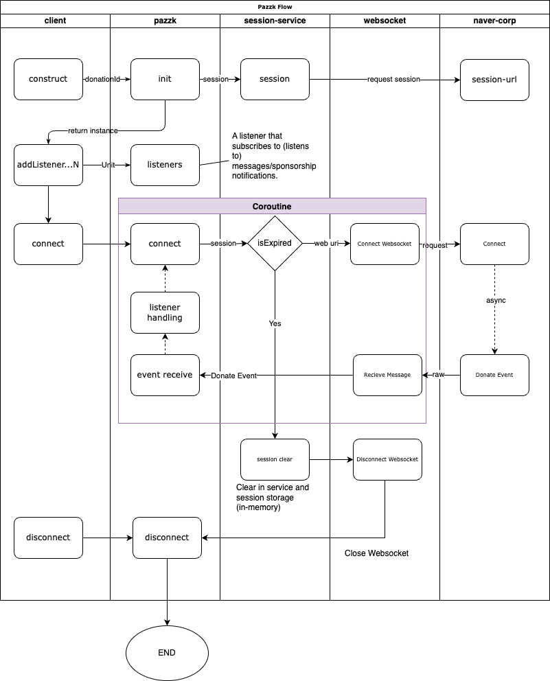

## Pazzk

치지직(chzzk)의 후원(치즈) 알림을 받아올 수 있는 Coroutine 기반 Kotlin API

## Flow Chart


## How To Use

```kotlin
// donation@YOUR_DONATE_KEY
val pazzk = Pazzk.pazzk("YOUR_DONATE_KEY", this)
pazzk.addListener {context ->
    when (context) {
        is Connection     -> {
            println("Connect success!")
        }

        is Error      -> {
            println("Error occurs! ${context.reason}")
        }

        is Donate -> {
            println("Thanks for ${context.payAmount}₩ donate!")
        }
    }
}
pazzk.connect()
delay(1000 * 60)
pazzk.disconnect()
```
